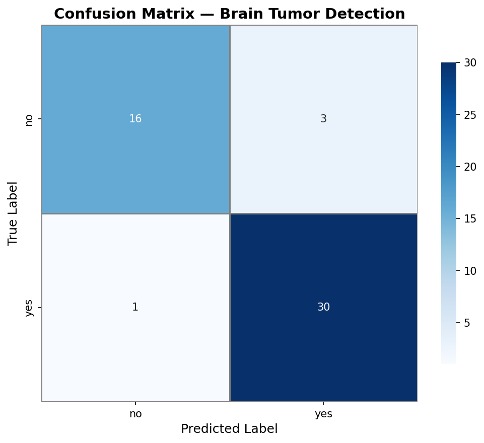
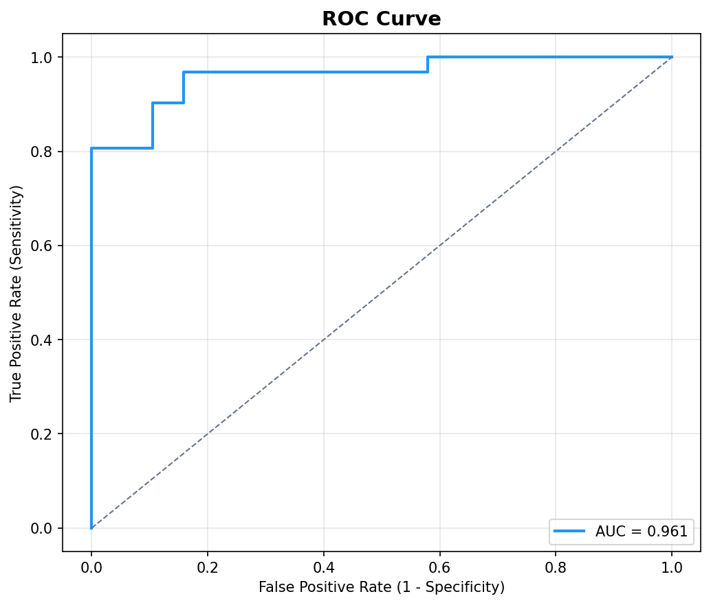

# Brain Tumor MRI Classification

Binary brain MRI tumor detection using **EfficientNetB0** transfer learning, with **Grad-CAM** explainability and a **Streamlit** demo.

[](https://github.com/khushbakt0/brain-tumor-detection/actions/workflows/ci.yml)
[](LICENSE)

**Topics:** `medical-imaging` `deep-learning` `tensorflow` `grad-cam` `streamlit` `transfer-learning` `mri`

---

## Overview

This project classifies axial brain MRI slices as **tumor** or **no tumor**. It is an academic portfolio system — **not for clinical use**.

| Component | Description |
|---|---|
| **Backbone** | EfficientNetB0 (ImageNet weights) |
| **Head** | GlobalAveragePooling → Dense(256) → Dense(128) → Softmax(2) |
| **Explainability** | Grad-CAM heatmaps |
| **Demo** | Streamlit web app (`app/streamlit_app.py`) |
| **Dataset** | [Kaggle Brain Tumor MRI Dataset](https://www.kaggle.com/datasets/masoudnickparvar/brain-tumor-mri-dataset) (~253 images) |

### Sample Results

After training, see `results/` or committed samples in `docs/assets/`:

| Confusion Matrix | ROC Curve |
|---|---|
|  |  |

---

## Quick Start

### 1. Clone and install

```bash
git clone https://github.com/khushbakt0/brain-tumor-detection.git
cd brain-tumor-detection
python -m venv .venv
# Windows: .venv\Scripts\activate
# Linux/macOS: source .venv/bin/activate
pip install -r requirements.txt
```

### 2. Prepare data

```bash
# Option A: Kaggle API
pip install kaggle
python scripts/download_data.py --kaggle

# Option B: Manual download — extract to dataset/yes/ and dataset/no/
python scripts/download_data.py --verify
```

### 3. Train

```bash
python train.py --data_dir dataset/ --epochs 30 --fine_tune
```

Outputs:
- `models/brain_tumor_model.h5` — best checkpoint
- `models/class_labels.json` — label index map
- `results/metrics.json` — accuracy, sensitivity, specificity, AUC-ROC
- `results/confusion_matrix.png`, `results/roc_curve.png`

### 4. Predict

```bash
python predict.py --image path/to/mri.jpg
python predict.py --image path/to/mri.jpg --no-gradcam
```

### 5. Streamlit demo

```bash
streamlit run app/streamlit_app.py
```

Features:
- Dashboard with validation metrics
- MRI upload, classification, and Grad-CAM
- **Clinical PDF report** generation (`reports/report_<timestamp>.pdf`)

### 6. Cross-validation (optional)

```bash
python scripts/cross_validate.py --folds 5 --epochs-per-fold 5
```

---

## Project Structure

```
brain-tumor-detection/
├── app/
│   └── streamlit_app.py       # Web demo
├── configs/
│   └── default.yaml           # Hyperparameters and paths
├── docs/
│   ├── DEPLOYMENT.md          # Streamlit Cloud / Hugging Face Spaces
│   ├── LIMITATIONS.md         # Medical AI limitations
│   └── assets/                # Sample result figures for README
├── scripts/
│   ├── download_data.py       # Kaggle / verify dataset
│   └── cross_validate.py      # Stratified k-fold CV
├── src/brain_tumor/
│   ├── config.py
│   ├── data.py
│   ├── model.py
│   ├── training.py
│   ├── inference.py
│   ├── evaluation.py
│   └── gradcam.py
├── tests/
├── train.py                   # Training entry point
├── predict.py                 # CLI inference
├── MODEL_CARD.md
├── requirements.txt
└── LICENSE
```

---

## Configuration

All defaults live in `configs/default.yaml`. Override via CLI:

```bash
python train.py --config configs/default.yaml --epochs 20 --batch_size 16 --fine_tune
```

**Important:** Inputs must stay in pixel range `[0, 255]`. EfficientNetB0 rescales internally. Dividing by 255 before the model causes collapsed predictions.

---

## Evaluation Metrics

| Metric | Meaning |
|---|---|
| **Accuracy** | Fraction of correct predictions |
| **Sensitivity** | Recall on tumor (`yes`) class |
| **Specificity** | Correct rejection of no-tumor cases |
| **AUC-ROC** | Threshold-independent discrimination |
| **F1 (weighted)** | Class-weighted F1 score |

See [MODEL_CARD.md](MODEL_CARD.md) for intended use, limitations, and ethical notes.

---

## Deployment

Live demo deployment (Streamlit Cloud, Hugging Face Spaces, Docker): [docs/DEPLOYMENT.md](docs/DEPLOYMENT.md).

---

## Development

```bash
pip install -r requirements-dev.txt
pytest tests/ -v
```

CI runs on GitHub Actions (`.github/workflows/ci.yml`).

---

## Disclaimer

**Research prototype — not for clinical use.** Do not use for diagnosis or treatment decisions. Consult a qualified neuroradiologist for medical evaluation.

---

## Author

**Khushbakht Sohail** — BS Data Science, FAST-NU Lahore

- [GitHub](https://github.com/khushbakt0)
- [LinkedIn](https://linkedin.com/in/khushbakht-sohail-b40024370)

---

## License

MIT — see [LICENSE](LICENSE).
